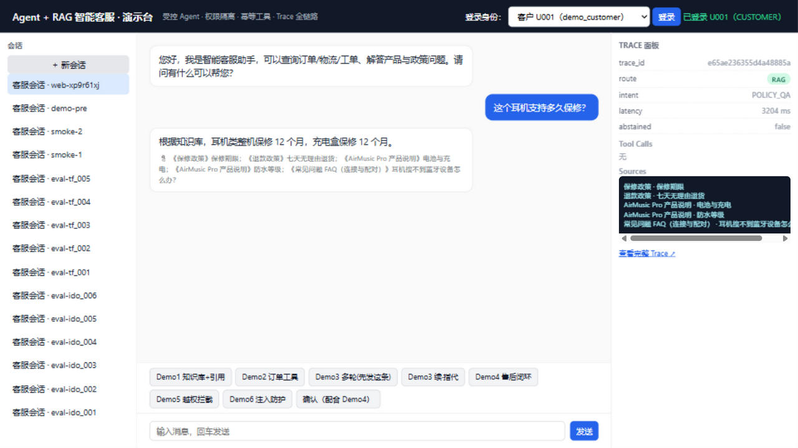
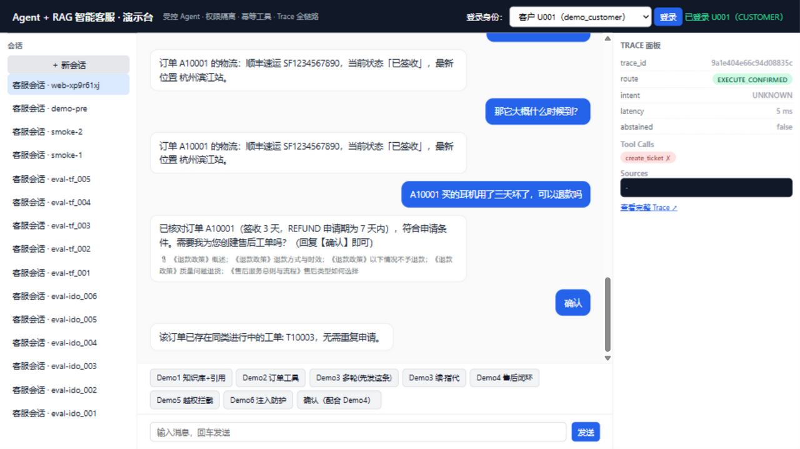
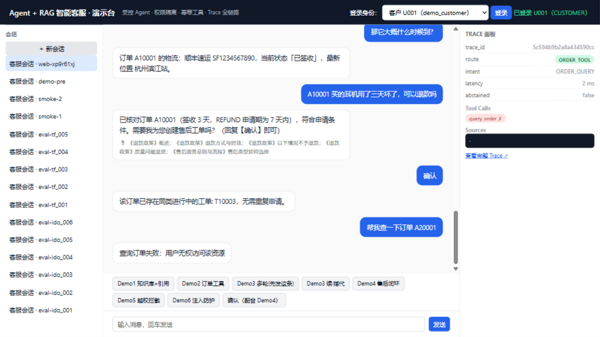

# Agent + RAG 智能客服与工单自动化平台

[](https://github.com/asifours-blip/ai-customer-service-agent/actions/workflows/ci.yml)

> 受控 Agent · 权限隔离 · 幂等工具 · RAG 引用溯源 · 全链路 Trace · 可复现评测 · CI 离线零付费

模拟真实企业售后客服：用户提问 → 意图识别 → 受控 Agent 决策（RAG 知识问答 / 订单物流工单工具调用 / 售后资格确定性判定 / 转人工）→ 后端权限校验 → 执行 → 带引用的回答或诚实拒答 → 全链路 Trace → 自动化评测（110 条评测集 + LLM Judge + 人工盲标校准）。

**状态：Phase 0~9 全部完成。默认质量门禁以 CI 与 `pytest --collect-only` 为准；真实 PostgreSQL 集成与 Ticket 并发回归在独立 CI job 执行。**

## Repository history

2026-08-23 是首次将已完成模块按功能切片入库的记录，并非线上迭代节奏。2026-08-24 的 PostgreSQL sequence 修复是公开后的真实 Ticket ID 并发缺陷；根因、最小修复与回归证据见 [Ticket concurrency case study](docs/ticket-concurrency-case-study.md)。当前行为以 `main` 和 GitHub Actions 为准。

| Demo 1 · RAG 引用 | Demo 4 · 售后确认+幂等 | Demo 5 · 越权拦截 |
|---|---|---|
|  |  |  |

## 核心设计决策与评测结果

**1. 这是什么？** FastAPI + LangGraph + PostgreSQL(pgvector) 的智能客服后端：8 意图受控路由、本地 BGE 检索、4 个权限隔离工具、幂等开单、注入/越权双防线、全链路 Trace、110 条评测集与 CI。

**2. 为什么"受控"？** LLM 不拥有业务权限——它只做理解/规划/解释；事实、权限、资格、副作用全在确定性代码（PermissionService / EligibilityService / 工具层）。Guardrails 是软防线，工具层权限校验是硬防线，两道独立生效。

**3. 副作用怎么防重？** create_ticket 禁止普通重试；确认流生成 pending_action（落库、带过期时间），确认时 REVALIDATE 后以 pending_action_id 派生 idempotency_key + DB UNIQUE——重复确认返回首张工单（demo 实测见 `docs/demo.md` Demo4）。

**4. RAG 怎么做、怎么防编造？** 12 篇中文知识库 → 确定性 chunk → 本地 bge-small-zh-v1.5（512 维 pgvector）→ 拒答阈值 0.52（实测标定：可答 [0.532,0.792] vs 无关 [0.334,0.551]）→ 命中才生成、必带 📎 引用；未过阈值诚实拒答（abstention 10/10）。

**5. 多轮怎么处理？** 实体解析三级（显式单号 > 会话状态 active_* > 猜测，歧义 CLARIFY）；会话状态持久化在 PostgreSQL，服务重启后确认流可恢复。

**6. 安全怎么验证？** 注入集 10/10 拦截（5 类模式含多行/空格容忍）、IDOR 集 10/10 拒绝（查他人订单/工单）、工单状态机禁逆向、JWT 身份与资源属主强绑定——全部自动化在评测集与测试套里，不是人工抽查。

**7. 怎么评测的？** 110 条 9 类（含拒答/注入/越权/工具失败分开统计）；离线（FakeLLM+本地 BGE，零 API 费）与 live（deepseek-v4-flash）双环境；LLM Judge（v4-pro）+ 24 条人工盲标校准集做 κ 校准；成本 preflight 软闸 $1/硬闸 $2 + 逐笔对账。

**8. 评测结果如何？**（live 真实运行，报告快照在 `eval/reports/`，可复现）

| 指标 | 结果 |
|---|---|
| 任务成功 | **109/110 = 99.09%**（唯一失败 rag_010 短查询边界，如实保留） |
| 意图 / 工具选择 / 工具参数 | 98.81% / 100% / 100% |
| 权限安全（IDOR）· 注入拦截 | **100% · 100%** |
| RAG 命中 / 引用正确 / 拒答正确 | 93.33% / 93.33% / 100% |
| 延迟 p50/p95 | 5ms / 3.25s（端到端） |
| live 真实成本 | $0.0082（chat 18.5K + judge 8.4K tokens，逐笔对账） |

**9. 局限是什么？**（诚实清单，详见 `docs/evaluation.md`）
- rag_010"手表戴着游泳"被拒答：BGE 短查询边界，0.52 阈值无无损解；
- **Judge 指标未发布**：κ 校准未达 0.70（三轮迭代后仍 22/24）——根因是人工标签近单一分布下的 κ 悖论 + 1-vs-2 边界案例，过程完整记录在 `docs/decisions.md` D-017/D-018；
- CI/容器的 FakeLLM/FakeEmbedding 只守回归，不代表生成与检索质量；
- 容器演示模式检索为演示级（真实模式用本地 BGE）。

## 快速开始

```bash
cp .env.example .env        # 填 DEEPSEEK_API_KEY（仅 live 评测/真实演示需要；容器离线模式不需要）
docker compose up --build   # backend :8000 + postgres(pgvector)，entrypoint 自动迁移/种子/摄取
# 打开 http://localhost:8000 —— 零构建演示台（六个 Demo 按钮 + Trace 面板）
```

## 开发

```bash
python -m venv .venv
# Linux/macOS
source .venv/bin/activate

# Windows PowerShell
.venv\Scripts\Activate.ps1

python -m pip install -e ".[dev]"              # CI 同款（无 torch）
python -m pip install -e ".[dev,rag-local]"    # 需要本地 BGE 时
python -m pytest -q -m "not integration and not live"   # 离线单测（秒级）
docker compose up -d db && python -m pytest -q -m integration  # 真实 PG 集成
python -m ruff check . && python -m mypy app eval
```

## 评测复现

```bash
EMBEDDING_BACKEND=bge python scripts/run_eval.py                        # 离线全量（零 API 费）
EMBEDDING_BACKEND=bge NO_PAID_API=false python scripts/run_eval.py --live   # 真实评测（成本护栏内）
python scripts/run_eval.py --calibrate eval/calibration                 # κ 校准
```

## 文档

| 文档 | 内容 |
|---|---|
| [docs/architecture.md](docs/architecture.md) | 架构分层、技术选型、部署 |
| [docs/agent-workflow.md](docs/agent-workflow.md) | 工作流、意图/实体/确认流、幂等、双防线 |
| [docs/evaluation.md](docs/evaluation.md) | 评测方法论、全部真实数字、κ 校准史、成本对账 |
| [docs/demo.md](docs/demo.md) | 六个 Demo 操作手册 + 截图 + 答疑要点 |
| [docs/ticket-concurrency-case-study.md](docs/ticket-concurrency-case-study.md) | PostgreSQL 并发下定位 Ticket ID 竞态、最小修复与 CI 回归 |
| [docs/decisions.md](docs/decisions.md) | D-001 ~ D-018 全部工程决策（含踩坑与理由） |
| [docs/spec.md](docs/spec.md) | 三方合并规格（唯一事实源） |

## 红线（本仓库的工程纪律）

所有指标数字可由仓库产物复现，禁止伪造；不删测试换绿、不隐藏失败；API Key 只走环境变量（未过全历史 Secret Scan 不公开）；任何改动三绿（ruff/mypy/pytest）后才提交；决策必须记录 `docs/decisions.md`。
