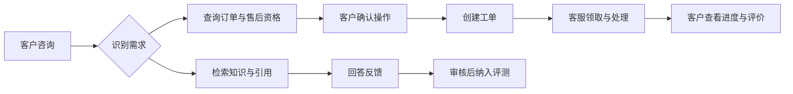

# 智能客服与工单协作平台

[](https://github.com/asifours-blip/ai-customer-service-agent/actions/workflows/ci.yml)

售后咨询既需要解释规则，也需要查询订单、确认操作和交给客服处理。本项目把知识问答、售后确认、工单协作和回答反馈接成一条流程：模型负责理解与表达，权限、资格和业务写入由后端校验。

客户可以追踪问题的处理过程，客服可以领取和处理工单，知识库管理员可以更新资料并追溯回答引用的版本。

## 使用流程



## 页面

以下为仓库已有的合成演示数据截图，展示本地客户端与客服工作台，不代表真实客户或线上处理量。操作说明见[演示指南](docs/demo.md)。

| 带引用的回答 | 操作前确认 | 客服工单队列 |
| --- | --- | --- |
|  |  |  |

## 它能做什么

- **处理咨询**：结合知识库回答问题，展示引用、售后判断依据与回答方式；资料不足时拒答或引导人工处理。
- **跟进工单**：客户查看订单、历史会话和处理时间线；客服领取、回复并推进状态，客户可补充信息与评价。
- **管理知识**：上传文档、查看导入校验、发布或回滚版本，旧回答仍能找到当时的引用原文。
- **积累样本**：审核回答反馈并转为版本化用例，封版后显式加载；使用同一组样本对比知识库版本。
- **保留记录**：通过 Trace 查看工具、检索和模型调用，配合数据库备份恢复保留会话与处理历史。

## 工程取舍

| 问题 | 处理方式 | 可核查位置 |
| --- | --- | --- |
| 幂等键可能返回他人工单或掩盖请求变化 | 按用户隔离键；正常命中与并发冲突恢复共用请求指纹校验，内容不符返回冲突 | [服务](app/services/tickets.py) · [跨用户回归](tests/integration/test_ticket_idempotency_scope.py) |
| 多人同时开单、领取或推进状态 | 数据库 sequence 分配编号，行锁串行化状态写入；业务事件与修改一起提交 | [并发案例](docs/ticket-concurrency-case-study.md) · [竞争回归](tests_stress/test_race_conditions.py) |
| 工具超时不等于写入失败 | 每次工具调用使用自己的数据库会话，保留原确认动作的幂等身份；未知结果不描述为明确失败 | [执行器](app/tools/executor.py) · [工作流](docs/agent-workflow.md) |
| 知识更新后引用失去依据 | 版本发布与回滚采用比较交换，数据库限制单一生效版本；旧版本保留以支持引用追溯 | [版本实现](app/kb/) · [设计决策](docs/decisions.md) |
| 模型故障与离线回答容易混淆 | 分类展示鉴权、限流、超时等错误，限制重试并标注回答方式；缺少有效用量时按上限计费 | [客户端](app/llm/deepseek.py) · [接入参考](docs/reference.md) |
| 反馈与恢复需要可追踪 | 审核记录只追加，评测用例封版并保存哈希；恢复演练核对引用、确认流和事件约束 | [评测](docs/evaluation.md) · [恢复记录](docs/backup-restore-drill.md) |

## 技术栈

FastAPI、LangGraph、SQLAlchemy、Alembic、PostgreSQL / pgvector；原生 JavaScript 工作台；本地 BGE 检索与 OpenAI 兼容模型客户端。测试使用 pytest、Ruff 和 mypy。

## 快速开始

安装 Docker Compose，在独立本地目录运行。默认 Compose 固定离线模型与演示检索，不需要模型密钥；首次构建需要下载依赖，运行会初始化演示数据。

```bash
docker compose up --build
# 打开 http://localhost:8000
# 本地演示：demo_customer / demo123
# 客服工作台：support_agent / demo123
```

先确认本机 8000、5432 端口空闲。演示账号仅用于隔离本地环境。完整账号、配置、源码开发与独立评测库要求见[运行参考](docs/reference.md#快速开始)；真实模型接入需另外配置。

## 验证状态

截至代码提交 [`1d9eb8e`](https://github.com/asifours-blip/ai-customer-service-agent/commit/1d9eb8ee93c03bfeeeffdd44c2e0c1944f29fc05)，[CI 36456495855](https://github.com/asifours-blip/ai-customer-service-agent/actions/runs/36456495855) 成功，包含离线检查、真实 PostgreSQL 集成与指定并发回归。浏览器流程与备份恢复的本地记录不等同于 CI。

历史模型实验、当前离线回归与真实接入分别记录。历史任务成功率的分母、安全用例范围、端到端延迟口径及 Judge 限制见[评测说明](docs/evaluation.md)和[详细参考](docs/reference.md)，不将旧成绩作为新增工作台或知识库流程的真实模型验收。

## 文档

| 文档 | 内容 |
| --- | --- |
| [系统架构](docs/architecture.md) | 分层、数据模型与部署关系 |
| [工作流](docs/agent-workflow.md) | 意图、实体、确认流与工具权限 |
| [演示指南](docs/demo.md) | 客户端、客服工作台与操作示例 |
| [评测说明](docs/evaluation.md) | 数据集、版本对比、历史结果与校准 |
| [设计决策](docs/decisions.md) | 权限、并发、知识库与模型错误处理 |
| [并发案例](docs/ticket-concurrency-case-study.md) | 编号冲突定位与数据库修复 |
| [备份恢复](docs/backup-restore-drill.md) | 本地演练命令、结果与范围 |
| [详细参考](docs/reference.md) | 完整配置、账号、开发命令、评测操作与历史说明 |
| [系统规格](docs/spec.md) | 业务规则及接口约定 |

## 局限

- 默认离线回答与检索用于验证流程，不代表真实模型质量；BGE 知识库冒烟查询仍需实测，见[接入边界](docs/reference.md)。
- 历史评测是固定样本结果；安全用例通过不等于完整安全审计，Judge 校准未达到该项目的发布门槛，见[评测说明](docs/evaluation.md)。
- 演示账号、单机配置和本地恢复记录不能替代正式部署的身份、秘密管理与运行验收。

## 仓库历史

项目于 2026-08-23 将已有模块按功能导入；后续补充并发修复、角色工作台、知识库版本与反馈评测流程。历史提交密度不表示线上运行周期，完整说明保留在[运行参考](docs/reference.md#repository-history)。
