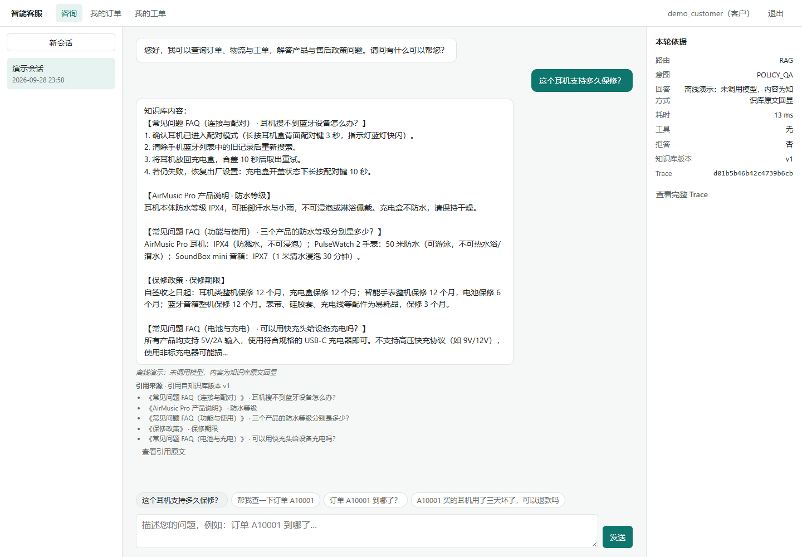
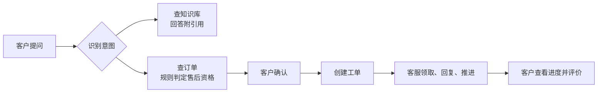
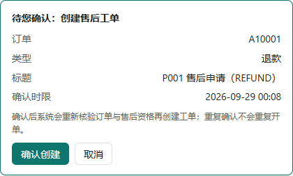
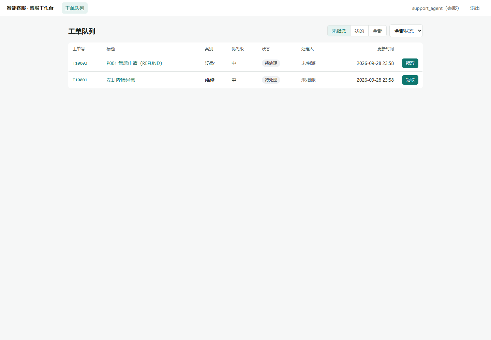
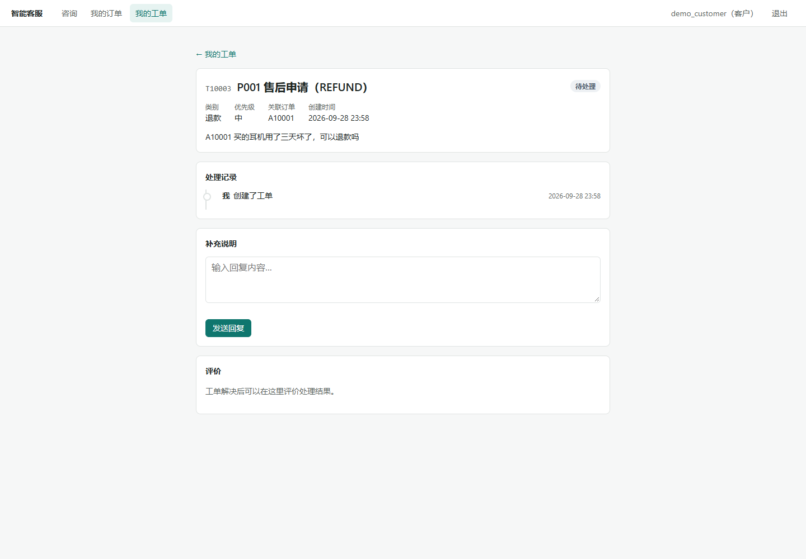

# 智能客服与工单协作平台

[](https://github.com/asifours-blip/ai-customer-service-agent/actions/workflows/ci.yml)

一个售后客服系统：客户用自然语言提问，系统查知识库、查订单、判断能不能退换，需要办理时先让客户确认，再生成工单交给客服处理。

做这个项目时，我最在意的一件事是：**模型可以负责理解和表达，但"能不能退款""这单是谁的""工单有没有建过"这类判断，必须交给确定性的代码。** 下面的大部分设计都是围绕这条线展开的。



## 一次完整的售后流程



| 客户确认操作 | 客服工单队列 | 工单处理时间线 |
| --- | --- | --- |
|  |  |  |

页面使用的是合成演示数据，完整的操作流程见[演示指南](docs/demo.md)。

## 几个值得一说的设计

**同一个请求，不会建出两张工单。** 模型调用工具时可能超时，超时并不代表没写进去。所以每次确认都带一个幂等键，这个键按用户隔离，还会校验请求内容：同一个键换了内容会被直接拒绝，而不是悄悄返回旧工单。开发中确实发现过一个用户能用别人的键取到别人工单的问题，修复之后补了[跨用户回归测试](tests/integration/test_ticket_idempotency_scope.py)。

**并发靠数据库兜底。** 两个客服同时领取同一张工单、并发推进状态、批量开单，都由行锁和数据库序列来保证只有一方成功。排查编号冲突的过程写成了[一篇案例](docs/ticket-concurrency-case-study.md)，压力测试在 CI 里用真实 PostgreSQL 跑。

**知识库能发版，也能回滚。** 更新资料要先经过草稿、校验，再发布成新版本；数据库保证同一时刻只有一个版本生效。旧版本不会被删除，所以早先的回答，仍然能追溯到它当时引用的原文。

**模型出错要说实话。** 鉴权失败、被限流、超时、响应被截断，分别归类展示，只对能安全重试的错误做重试。缺少配置时直接报错，不会偷偷换成模板回答；用量无法确认的调用按上限计费。

**用户反馈能变成评测用例。** 客户对回答的评价经管理员审核后，可以转成评测用例，并按版本封存。之后同一组样本可以用来对比两个知识库版本的差异。

## 技术栈

FastAPI · LangGraph · SQLAlchemy / Alembic · PostgreSQL + pgvector · 原生 JavaScript 前端 · pytest / Playwright / Ruff / mypy · GitHub Actions

## 本地运行

```bash
docker compose up --build
# 浏览器打开 http://localhost:8000
# 客户账号 demo_customer / demo123，客服账号 support_agent / demo123
```

默认使用离线模式，不需要模型密钥。源码开发、测试命令和接入真实模型的方法见[运行参考](docs/reference.md)。

## 文档

- [系统架构](docs/architecture.md)、[Agent 工作流](docs/agent-workflow.md)、[设计决策记录](docs/decisions.md)
- [评测说明](docs/evaluation.md)：数据集、版本对比和历史结果
- [备份恢复演练](docs/backup-restore-drill.md)、[系统规格](docs/spec.md)

## 目前的边界

- 离线模式下的回答只用来验证流程是否走通；换成真实模型后，回答质量还需要重新评测。
- 本地向量模型（BGE）的检索效果还没实测过。
- 演示账号和单机部署配置只适合本地体验，正式上线还需要另行处理身份认证和密钥管理。
